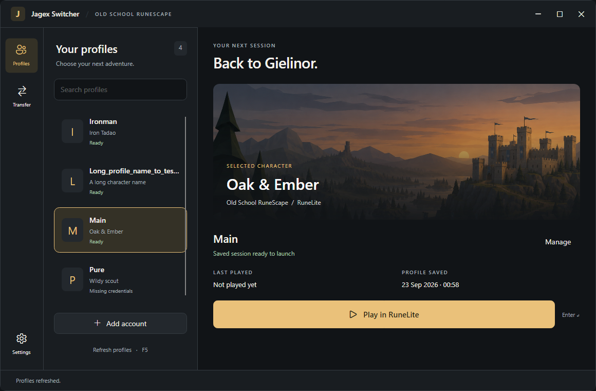

# Jagex Switcher

**Your characters. One place to play.**

A Windows account switcher for Old School RuneScape and RuneLite. Save a profile for each character, find the one you want, and launch RuneLite with its saved session.

[Download the latest release](https://github.com/Ku-Tadao/jagex-switcher/releases/latest) · [Setup guide](docs/ACCOUNT_SWITCHER.md) · [Privacy](docs/PRIVACY.md)



*Sample accounts shown. Built with C# and Avalonia, with dark, light, and Windows high-contrast support.*

## What it does

- **Switch characters:** searchable profiles with character names, session status, and last-played timestamps.
- **Capture once:** guided setup through Jagex Launcher saves the character you launch in RuneLite.
- **Keep sessions local:** saved credentials are encrypted for your Windows user account.
- **Move to another PC:** optional pairing transfers one profile using a temporary URL and an eight-digit code.
- **Stay in control:** rename, re-import, or remove profiles, with confirmation before deletion.

## Get started

You need **Windows x64**, **Jagex Launcher**, and **RuneLite** installed for the same Windows user. The release is a self-contained executable, so no separate .NET installation is required. Downloads require repository access while this project is private.

1. Download `JagexSwitcher.exe` from [Releases](https://github.com/Ku-Tadao/jagex-switcher/releases/latest) and run it.
2. Close any running RuneLite or official game client, then choose **Add Account**.
3. Optionally name the profile and select **Open launcher & capture**.
4. Sign in through Jagex Launcher, select your character, and launch **RuneLite**. Keep Jagex Launcher open while capture completes.
5. Once the profile appears, select it and choose **Play in RuneLite** for future launches.

Repeat capture for each character. A blank profile name uses the captured character name. **Add Current** imports an existing RuneLite credential file without starting guided capture.

Saved sessions can expire. If a profile stops working, sign in through Jagex Launcher again and re-import it. The switcher does not store your Jagex password or replace the official sign-in process.

## Transfer a profile

1. On the sending PC, select a profile and open **Transfer > Send > Create secure pair**.
2. On the other PC, open **Transfer > Receive**, paste the **Pair URL** and **Pair code**, and choose **Receive profile**.
3. Keep the sending app open until the import finishes.

Both PCs need internet access. On first send, the app downloads Cloudflare's `cloudflared` helper and caches it locally. Sharing closes after one successful transfer, 15 minutes, five incorrect code attempts, **Stop sharing**, or app exit.

Transfer sends session credentials over HTTPS through Cloudflare Tunnel. It is not end-to-end encrypted by the app. Treat the URL and code as sensitive and use this only between devices you control. The receiving PC encrypts the imported credentials for its own Windows user.

## Storage and privacy

The vault lives outside the application and repository:

```text
%APPDATA%\jagex-account-switcher\
  profiles.json       Profile names, character names, and timestamps
  credentials\        Windows DPAPI-encrypted session files
  tools\              Cloudflare Tunnel helper, downloaded on first send
```

Credential encryption is tied to your Windows user, so copying the vault to another PC is not a supported transfer method. Profile metadata is not encrypted.

Guided capture temporarily enables RuneLite's credential export. After a successful capture, the app disables it and deletes the live export. Cancelling capture also disables export. Normal **Play** disables capture unless you explicitly keep it enabled in advanced settings.

There is no app analytics service or developer-operated backend. See the [privacy policy](docs/PRIVACY.md) for local storage and optional network activity.

## Keyboard shortcuts

| Key | Action |
| --- | --- |
| Enter | Play the selected character from the profile list |
| F5 | Refresh profiles |
| F2 | Open profile management and rename |
| Delete | Remove the selected profile after confirmation |
| Escape | Close a dialog or cancel guided capture |

Right-click a profile for play, management, re-import, and removal actions.

## Build from source

Use Windows and the .NET 8 SDK. Open `JagexSwitcher.sln` in Visual Studio, or run:

```powershell
dotnet build JagexSwitcher.sln -c Release
dotnet run --project app/JagexSwitcher.VisualCheck -c Release -- .local/avalonia-check
.\publish-app.cmd
```

The packaged app is written to `dist/avalonia/JagexSwitcher.exe`. Publishing runs the executable's service self-check and preserves previous local builds. The UI checks use isolated sample profiles and render screenshots without touching your real vault.

Pushes to `main` run the [release workflow](.github/workflows/release.yml), check the app, and attach a self-contained executable to a new GitHub Release.

- [Account setup and implementation details](docs/ACCOUNT_SWITCHER.md)

---

An independent project, not affiliated with or endorsed by Jagex or RuneLite. RuneScape and Old School RuneScape belong to Jagex. The landscape is original decorative artwork, not an official game screenshot.
